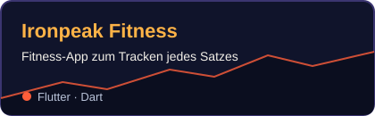
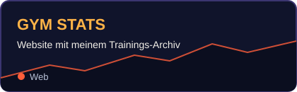

<div align="center">


<a href="https://git.io/typing-svg">
  
</a>

<br>

<a href="https://github.com/Sieder2009/GymTracker"></a>
<a href="https://github.com/Sieder2009/HOME"></a>


</div>

<br>

```console
$ ironpeak --heute
✔ Aufwärmen     Flutter & Dart
✔ Hauptsatz     Ironpeak Fitness weiterbauen
✔ Zusatzsatz    GYM STATS pflegen
⏳ Nächster PR   kommt bald
```

<h2 align="center">🏔️ Projekte</h2>

<div align="center">

<a href="https://github.com/Sieder2009/GymTracker"></a>
<a href="https://github.com/Sieder2009/HOME"></a>

</div>

<h2 align="center">🎒 Ausrüstung</h2>

<div align="center">
  
</div>

<h2 align="center">📈 Fortschritt</h2>

<div align="center">


</div>

<h2 align="center">🐍 Gipfelroute</h2>

<div align="center">
  
</div>


